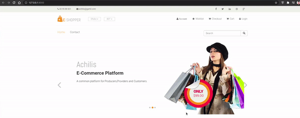

# To Run the Project
## Demo
<bnr />
<bnr />

## Installation

### Install PHP
sudo apt install php libapache2-mod-php

sudo apt install php-mysql php-gd

sudo apt install php-xml

### Install Laravel
sudo apt install composer

composer global require "laravel/installer=~1.1"

### Install Net-Tools
sudo apt install net-tools

### Install Xampp
Download Xampp

sudo chmod 755 xampp-linux-x64-8.0.11-1-installer.run 

sudo ./xampp-linux-x64-8.0.11-1-installer.run 

### Start/Stop Xampp
sudo /opt/lampp/xampp stop

sudo /opt/lampp/xampp start

### Stopping Services
sudo /etc/init.d/apache2 stop

sudo /etc/init.d/mysql stop 

sudo /etc/init.d/proftpd stop

## Running the Project
* sudo cdmod 777 htdocs
* Clone at /opt/lamp/htdocs 
* composer update
* cp .env.example .env
* php artisan key:generate
* Configure DB in .env
    DB_CONNECTION=mysql
    
    DB_HOST=127.0.0.1
    
    DB_PORT=3306
    
    DB_DATABASE=ecommerce
    
    DB_USERNAME=root
    
    DB_PASSWORD=

http://localhost/phpmyadmin/

### Create database ecommerce
php artisan migrate

php artisan serve
	
